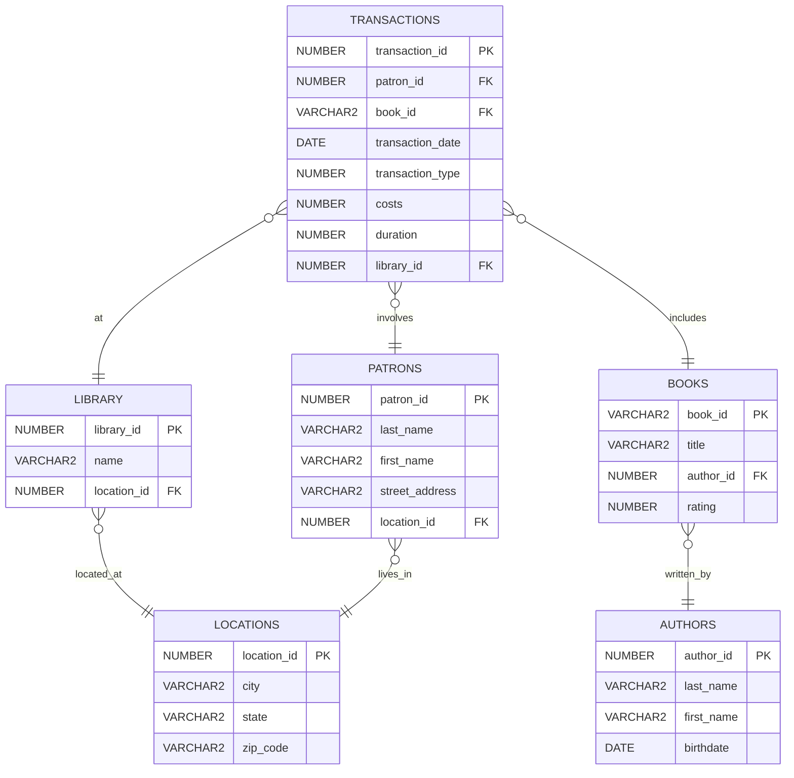
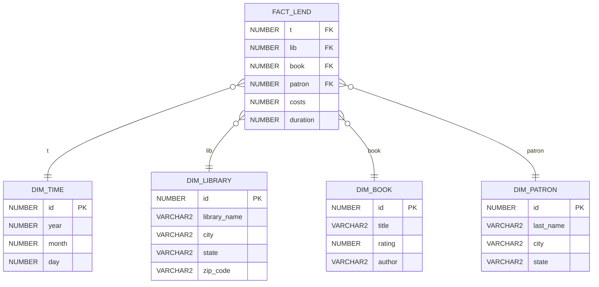

In dieser Übung modellieren Sie ein Star-Schema für eine Bibliothek,
erstellen Dimensionen und Faktentabellen und leiten Analyseabfragen ab.

## Aufgabenüberblick

| Angabe:   |
| :-------- |
| 🌐 Link zur [Aufgabe auf Moodle](https://edufs.edu.htl-leonding.ac.at/moodle/mod/assign/view.php?id=213382) |
| 📄Fetched [`angabe/moodle_angabe.md`](angabe/moodle_angabe.md) |

> ## *Star-Schema Bibliothek*
>
> > **Geöffnet**: Mittwoch, 17. September 2025, 00:00
> > **Fällig**: Dienstag, 30. September 2025, 00:00
>
> > Überführen Sie das gegebene OLTP-Schema in ein Star-Schema.
> >
> > 1. Ergänzen Sie den Code der Stunde um die Bibliotheks-Dimension DIM_LIBRARY
> >
> > 2. Befüllen Sie diese Dimension mit Werten
> >
> > 3. Befüllen Sie die Faktentabelle FACT_LEND, indem Sie mittels SubQuery  
> >    zu jeder Dimension den passenden Foreign-Key finden, sowie Primary-Key & Measures ergänzen.
> >
> > *Nutzen Sie dabei die bereits in der Stunde ausgearbeiteten Statements als Ausgangsbasis*:
> >
> > **↳** [📄 `stunde_star_schema_bibliothek.sql`](docs/stunde_star_schema_bibliothek.sql)  
> > **↳** [📄 `library_schema.sql`](angabe/library_schema.sql)  <!--17. September 2025, 16:39-->
>

---

## ER-Diagramm – Ausgangslage (OLTP)



---

## ER-Diagramm – finale Star-Schema-Sicht



Erläuterungen:

- `DIM_LIBRARY` ergänzt die Dimensionen aus dem Unterricht um Bibliotheksdaten (Name und Standort denormalisiert).
- `FACT_LEND` speichert Measures `costs` und `duration`; Primärschlüssel ist zusammengesetzt aus den Dimension-FKs, wie im Unterricht vorgegeben.

---

## Ausführungsreihenfolge (empfohlen)

1. OLTP-Schema initialisieren: `sql/init_schema_library.sql`
2. Unterrichtsskript ausführen: `docs/stunde_star_schema_bibliothek.sql` (legt u. a. `DIM_BOOK`, `DIM_TIME`, `DIM_PATRON`, `FACT_LEND` an und befüllt Basisdimensionen)
3. Bibliotheksdimension anlegen und befüllen:
   - `sql/01_dim_library_ddl.sql`
   - `sql/02_dim_library_load.sql`
4. Faktentabelle befüllen: `sql/03_fact_lend_load.sql`

<!-- Hinweis: Alle Load-Skripte sind idempotent ausgelegt (löschen vor Neu-Ladung), sodass sie mehrfach ausgeführt werden können. -->

### 1. OLTP-Schema initialisieren

```sql
CREATE TABLE DIM_LIBRARY (
  ID            NUMBER       PRIMARY KEY,
  LIBRARY_NAME  VARCHAR2(30) NOT NULL,
  CITY          VARCHAR2(30) NOT NULL,
  STATE         VARCHAR2(30) NOT NULL,
  ZIP_CODE      VARCHAR2(10) NOT NULL,
  CONSTRAINT UQ_DIM_LIBRARY UNIQUE (LIBRARY_NAME, CITY, STATE, ZIP_CODE)
);
```

### 2. Unterrichtsskript ausführen

```sql
INSERT INTO DIM_LIBRARY (ID, LIBRARY_NAME, CITY, STATE, ZIP_CODE)
SELECT
  DIM_LIBRARY_SEQ.NEXTVAL   AS ID,
  l.name                    AS LIBRARY_NAME,
  loc.city                  AS CITY,
  loc.state                 AS STATE,
  loc.zip_code              AS ZIP_CODE
FROM LIBRARY l
JOIN LOCATIONS loc ON loc.location_id = l.location_id;
```

### 3. Bibliotheksdimension anlegen und befüllen

```sql
-- Sicherstellen, dass FACT_LEND existiert (erst nach vorhandenen Dimensionen)
DECLARE
  v_exists   NUMBER;
  v_attempts NUMBER := 0;
BEGIN
  LOOP
    SELECT COUNT(*) INTO v_exists FROM user_tables WHERE table_name = 'FACT_LEND';
    IF v_exists = 0 THEN
      BEGIN
        EXECUTE IMMEDIATE 'CREATE TABLE FACT_LEND(
          t      NUMBER REFERENCES DIM_TIME(id),
          lib    NUMBER REFERENCES DIM_LIBRARY(id),
          book   NUMBER REFERENCES DIM_BOOK(id),
          patron NUMBER REFERENCES DIM_PATRON(id),
          costs  NUMBER,
          duration NUMBER,
          PRIMARY KEY(t, lib, book, patron)
        )';
        EXIT;
      EXCEPTION
        WHEN OTHERS THEN
          IF SQLCODE = -955 THEN
            EXIT; -- already exists
          ELSIF SQLCODE = -54 THEN
            v_attempts := v_attempts + 1;
            IF v_attempts < 5 THEN
              DBMS_LOCK.SLEEP(0.5);
            ELSE
              RAISE;
            END IF;
          ELSE
            RAISE;
          END IF;
      END;
    ELSE
      EXIT;
    END IF;
  END LOOP;
END;
/
-----------------------------------------------

BEGIN
  EXECUTE IMMEDIATE 'DROP TABLE PATRON_DIM_ID';
EXCEPTION WHEN OTHERS THEN NULL;
END;
/

CREATE TABLE PATRON_DIM_ID AS
SELECT
  p.patron_id                 AS id_alt,
  MIN(dp.id)                  AS id_dim
FROM PATRONS p
JOIN LOCATIONS l ON l.location_id = p.location_id
JOIN DIM_PATRON dp
  ON dp.last_name = p.last_name
 AND dp.city      = l.city
 AND dp.state     = l.state
GROUP BY p.patron_id;
-----------------------------------------------

BEGIN
  EXECUTE IMMEDIATE 'DROP TABLE LIBRARY_DIM_ID';
EXCEPTION WHEN OTHERS THEN NULL;
END;
/

CREATE TABLE LIBRARY_DIM_ID AS
SELECT
  lib.library_id             AS id_alt,
  MIN(dl.id)                 AS id_dim
FROM LIBRARY lib
JOIN LOCATIONS loc ON loc.location_id = lib.location_id
JOIN DIM_LIBRARY dl
  ON dl.LIBRARY_NAME = lib.name
 AND dl.CITY         = loc.city
 AND dl.STATE        = loc.state
 AND dl.ZIP_CODE     = loc.zip_code
GROUP BY lib.library_id;
-----------------------------------------------

-- Idempotenz: FACT_LEND leeren, damit das Skript mehrfach ausführbar ist
BEGIN
  EXECUTE IMMEDIATE 'DELETE FROM FACT_LEND';
EXCEPTION WHEN OTHERS THEN NULL;
END;
-- [..Zeilen ausgeblendet..]

INSERT INTO FACT_LEND (t, lib, book, patron, costs, duration)
SELECT
  tm.id                      AS t,
  ldm.id_dim                 AS lib,
  bm.id                      AS book,
  pd.id_dim                  AS patron,
  tr.costs,
  tr.duration
FROM TRANSACTIONS tr
JOIN BOOKS b    ON b.book_id   = tr.book_id
JOIN AUTHORS a  ON a.author_id = b.author_id
JOIN (
  SELECT year, month, day, MIN(id) AS id
  FROM DIM_TIME
  GROUP BY year, month, day
) tm
  ON tm.year  = EXTRACT(YEAR  FROM tr.transaction_date)
 AND tm.month = EXTRACT(MONTH FROM tr.transaction_date)
 AND tm.day   = EXTRACT(DAY   FROM tr.transaction_date)
JOIN LIBRARY_DIM_ID ldm ON ldm.id_alt = tr.library_id
JOIN PATRON_DIM_ID  pd  ON pd.id_alt  = tr.patron_id
JOIN (
  SELECT title, author, MIN(id) AS id
  FROM DIM_BOOK
  GROUP BY title, author
) bm
  ON bm.title  = b.title
 AND bm.author = a.last_name;
```

---

## Kurze technische Notizen

- `DIM_LIBRARY` verwendet einen Surrogat-Schlüssel (Sequenz `DIM_LIBRARY_SEQ`).
- `PATRON_DIM_ID` und `LIBRARY_DIM_ID` sind Mappingtabellen, um die OLTP-IDs stabil auf die Dimensions-IDs abzubilden.
- Die Auflösung der Zeitdimension erfolgt über Vergleich von `EXTRACT(year|month|day FROM transaction_date)`.

---

<!--
## Abgabehinweise

- Diagramme als Bild/Markdown einbinden
- Abgabe als Git-Repository mit sauberer Historie

  ### Git-Workflow (Empfehlung)
  
  - `main` stabil halten; Feature-Branches für Teilaufgaben
  - Aussagekräftige Commits in kleinen Schritten

  ### Struktur

  - `angaben/` Aufgabenstellung/Material
  - `docs/` Relevante Dokumente aus dem Unterricht
  - `sql/` Optional DDL/Abfragen
-->