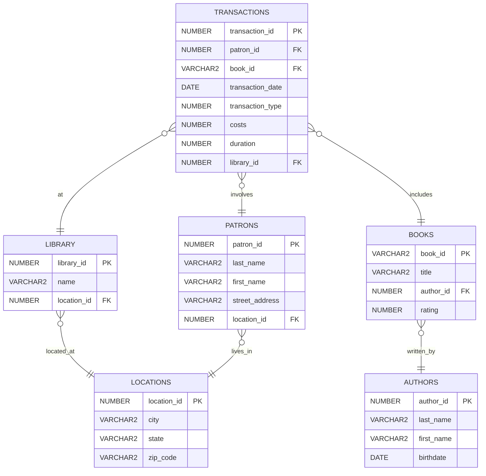
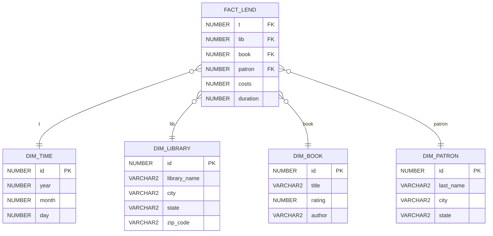

## Überblick

Diese Abgabe dokumentiert die Umsetzung des Star-Schemas für die Bibliothek basierend auf dem gegebenen OLTP-Schema. Enthalten sind:

- DIM_LIBRARY: Definition und Beladung
- FACT_LEND: Beladung mit Subqueries zur Auflösung der Dimension-Fremdschlüssel
- ER-Diagramme: Ausgangslage (OLTP) und finale Star-Schema-Sicht

## Artefakte in diesem Repository

- `sql/01_dim_library_ddl.sql` – DDL für `DIM_LIBRARY`
- `sql/02_dim_library_load.sql` – Beladen der `DIM_LIBRARY`
- `sql/03_fact_lend_load.sql` – Befüllen von `FACT_LEND` (Fremdschlüssel-Auflösung per Subqueries/Mapping)
- `angabe/library_schema.sql` – OLTP-Ausgangsschema
- `docs/stunde_star_schema_bibliothek.sql` – Unterrichtsskript (DIM_TIME, DIM_BOOK, DIM_PATRON, FACT_LEND)

---

## ER-Diagramm – Ausgangslage (OLTP)



---

## ER-Diagramm – finale Star-Schema-Sicht



Erläuterungen:

- `DIM_LIBRARY` ergänzt die Dimensionen aus dem Unterricht um Bibliotheksdaten (Name und Standort denormalisiert).
- `FACT_LEND` speichert Measures `costs` und `duration`; Primärschlüssel ist zusammengesetzt aus den Dimension-FKs, wie im Unterricht vorgegeben.

---

## Ausführungsreihenfolge (empfohlen)

1. OLTP-Schema initialisieren: `sql/init_schema_library.sql`
2. Unterrichtsskript ausführen: `docs/stunde_star_schema_bibliothek.sql` (legt u. a. `DIM_BOOK`, `DIM_TIME`, `DIM_PATRON`, `FACT_LEND` an und befüllt Basisdimensionen)
3. Bibliotheksdimension anlegen und befüllen:
   - `sql/01_dim_library_ddl.sql`
   - `sql/02_dim_library_load.sql`
4. Faktentabelle befüllen: `sql/03_fact_lend_load.sql`

<!-- Hinweis: Alle Load-Skripte sind idempotent ausgelegt (löschen vor Neu-Ladung), sodass sie mehrfach ausgeführt werden können. -->

### 1. OLTP-Schema initialisieren

```sql
CREATE TABLE DIM_LIBRARY (
  ID            NUMBER       PRIMARY KEY,
  LIBRARY_NAME  VARCHAR2(30) NOT NULL,
  CITY          VARCHAR2(30) NOT NULL,
  STATE         VARCHAR2(30) NOT NULL,
  ZIP_CODE      VARCHAR2(10) NOT NULL,
  CONSTRAINT UQ_DIM_LIBRARY UNIQUE (LIBRARY_NAME, CITY, STATE, ZIP_CODE)
);

-- Sequenz für Surrogat-Schlüssel der Dimension
CREATE SEQUENCE DIM_LIBRARY_SEQ START WITH 1 INCREMENT BY 1 NOCACHE;
```

### 2. Unterrichtsskript ausführen

```sql
INSERT INTO DIM_LIBRARY (ID, LIBRARY_NAME, CITY, STATE, ZIP_CODE)
SELECT
  DIM_LIBRARY_SEQ.NEXTVAL   AS ID,
  l.name                    AS LIBRARY_NAME,
  loc.city                  AS CITY,
  loc.state                 AS STATE,
  loc.zip_code              AS ZIP_CODE
FROM LIBRARY l
JOIN LOCATIONS loc ON loc.location_id = l.location_id;
```

### 3. Bibliotheksdimension anlegen und befüllen

```sql
CREATE TABLE PATRON_DIM_ID AS
SELECT
  p.patron_id                 AS id_alt,
  MIN(dp.id)                  AS id_dim
FROM PATRONS p
JOIN LOCATIONS l ON l.location_id = p.location_id
JOIN DIM_PATRON dp
  ON dp.last_name = p.last_name
 AND dp.city      = l.city
 AND dp.state     = l.state
GROUP BY p.patron_id;

BEGIN
  EXECUTE IMMEDIATE 'DROP TABLE LIBRARY_DIM_ID';
EXCEPTION WHEN OTHERS THEN NULL;
END;

CREATE TABLE LIBRARY_DIM_ID AS
SELECT
  lib.library_id             AS id_alt,
  MIN(dl.id)                 AS id_dim
FROM LIBRARY lib
JOIN LOCATIONS loc ON loc.location_id = lib.location_id
JOIN DIM_LIBRARY dl
  ON dl.LIBRARY_NAME = lib.name
 AND dl.CITY         = loc.city
 AND dl.STATE        = loc.state
 AND dl.ZIP_CODE     = loc.zip_code
GROUP BY lib.library_id;

WITH TIME_MAP AS (
  SELECT year, month, day, MIN(id) AS id
  FROM DIM_TIME
  GROUP BY year, month, day
),
BOOK_MAP AS (
  SELECT title, author, MIN(id) AS id
  FROM DIM_BOOK
  GROUP BY title, author
)
INSERT INTO FACT_LEND (t, lib, book, patron, costs, duration)
SELECT
  tm.id                      AS t,
  ldm.id_dim                 AS lib,
  bm.id                      AS book,
  pd.id_dim                  AS patron,
  tr.costs,
  tr.duration
FROM TRANSACTIONS tr
JOIN BOOKS b    ON b.book_id   = tr.book_id
JOIN AUTHORS a  ON a.author_id = b.author_id
JOIN TIME_MAP tm
  ON tm.year  = EXTRACT(YEAR  FROM tr.transaction_date)
 AND tm.month = EXTRACT(MONTH FROM tr.transaction_date)
 AND tm.day   = EXTRACT(DAY   FROM tr.transaction_date)
JOIN LIBRARY_DIM_ID ldm ON ldm.id_alt = tr.library_id
JOIN PATRON_DIM_ID  pd  ON pd.id_alt  = tr.patron_id
JOIN BOOK_MAP bm
  ON bm.title  = b.title
 AND bm.author = a.last_name;
```

---

## Kurze technische Notizen

- `DIM_LIBRARY` verwendet einen Surrogat-Schlüssel (Sequenz `DIM_LIBRARY_SEQ`).
- `PATRON_DIM_ID` und `LIBRARY_DIM_ID` sind Mappingtabellen, um die OLTP-IDs stabil auf die Dimensions-IDs abzubilden.
- Die Auflösung der Zeitdimension erfolgt über Vergleich von `EXTRACT(year|month|day FROM transaction_date)`.
